# How to use Mermaid.

Mermaid can be used in a lot of things including flowchart, ER Diagrams, State, Maps, Architecture.

## 1. Flowcharts

Everything starts with:

```
graph TD
```

or

```
flowchart TD
```

Both are equivalent

TD -> Top down
LR -> Left right
RL -> Left right
DT -> Down Top

## 2. Nodes

Every box is called a node.

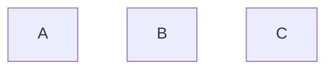

Connect them with Arrows

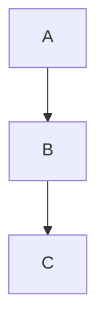

## 3. Labels

Instead of:

```
A
```

you can write:

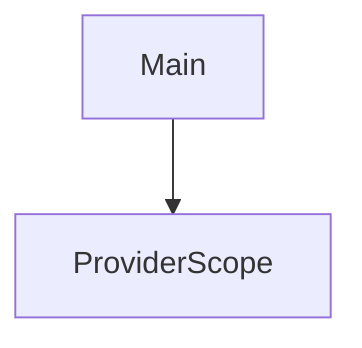

## 4. Node Shapes

| Symbol | Shape              | Example           |
| :----- | :----------------- | :---------------- |
| []     | Rectangle          | A[Test]           |
| ()     | Rounded            | A(Test)           |
| ([])   | Database           | A([Test])         |
| (())   | Circle             | A((Test))         |
| {}     | Diamond            | A{Authenticated?} |
| {{}}   | Hexagon            | A{{Riverpod}}     |
| [//]   | Trapezoid          | A[/Input/]        |
| [\\\\] | Inverted Trapezoid | A[\\Output\\]     |

## 5. Arrow Types

| Symbol  | Shape         | Example       |
| :------ | :------------ | :------------ |
| -->     | Normal Arrow  | A --> B       |
| ---     | Open Arrow    | A --- B       |
| -.->    | Dotted        | A -.-> B      |
| A ==>   | Thick         | A ==> B       |
| -->\|\| | Text on arrow | A-->\|test\|B |

## 6. Multiple Connections

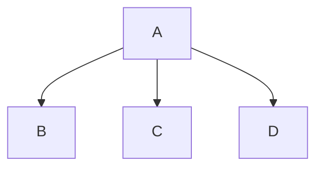

## 7. Chains

instead of

```
A --> B
B --> C
C --> D
```

write

```
A --> B --> C --> D
```

## 8. Multiple Nodes

```
A --> B
A --> C
A --> D
```

can become


## 9. Comments

```
%% is ignored
```

## 10. Subgraphs

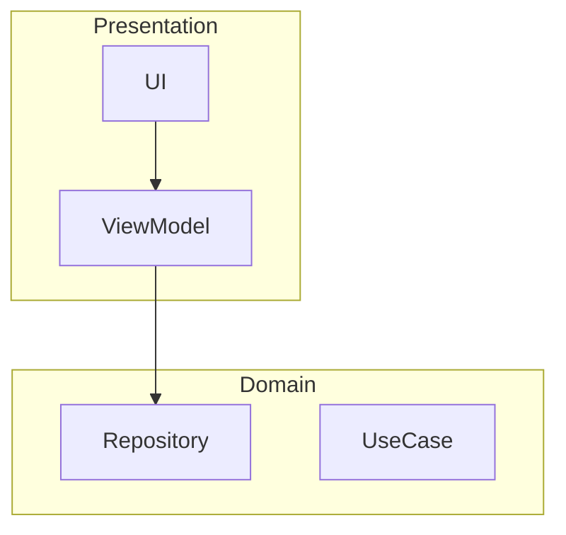

## Examples

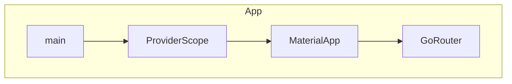

## Decision Trees

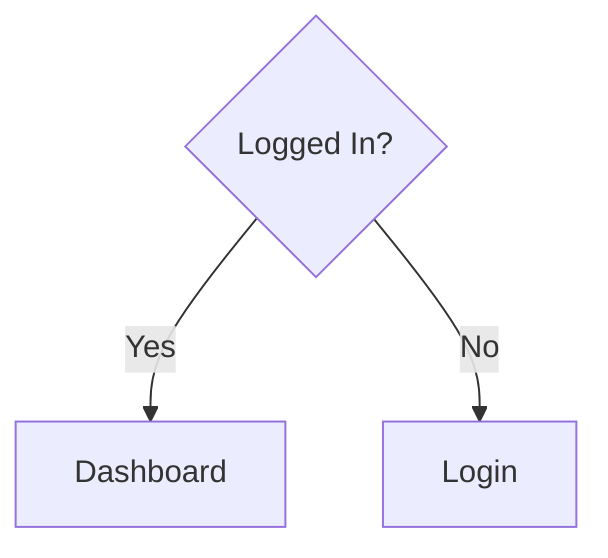

## Styling

Color one node

```
style A fill:#4caf50
```

```
style A stroke:#000
```

```
style A color:#fff
```

```
style A fill:#2196F3,stroke:#333,color:#fff
```

## Classes

```
classDef provider fill:#2196f3,color:#fff
class A provider
```

## Sequence Diagram

For API Calls

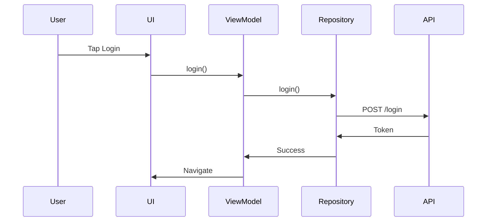

## Class Diagram

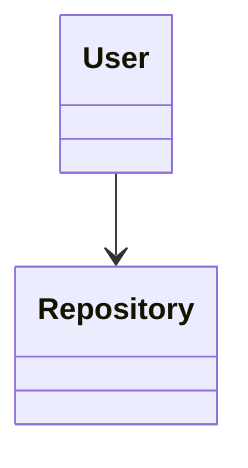

## ER Diagram

Database

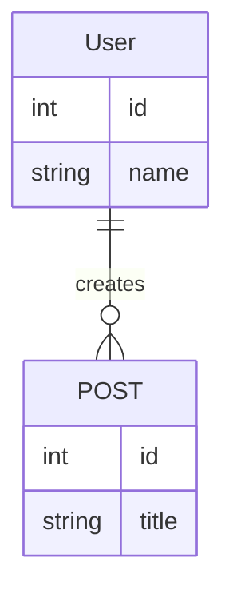

## State Diagram

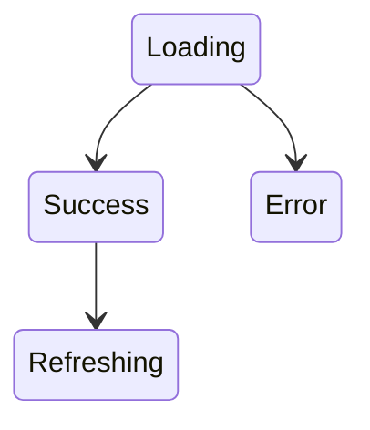

## Mindmap

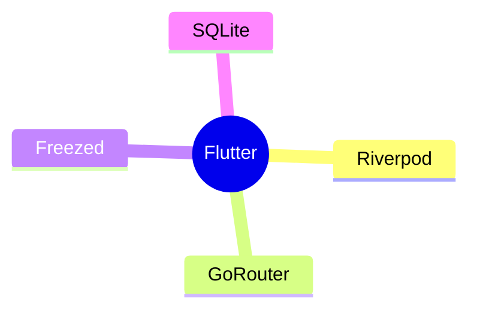

## Architecture Diagram (new)

```mermaid
architecture-beta

group app

service ui

service api

ui:R --> L:api
```

## Project Example

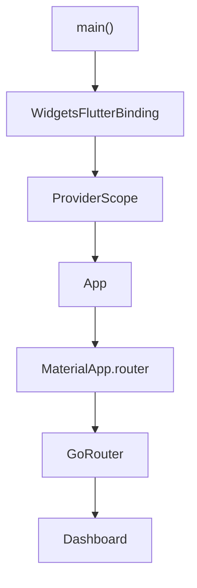
